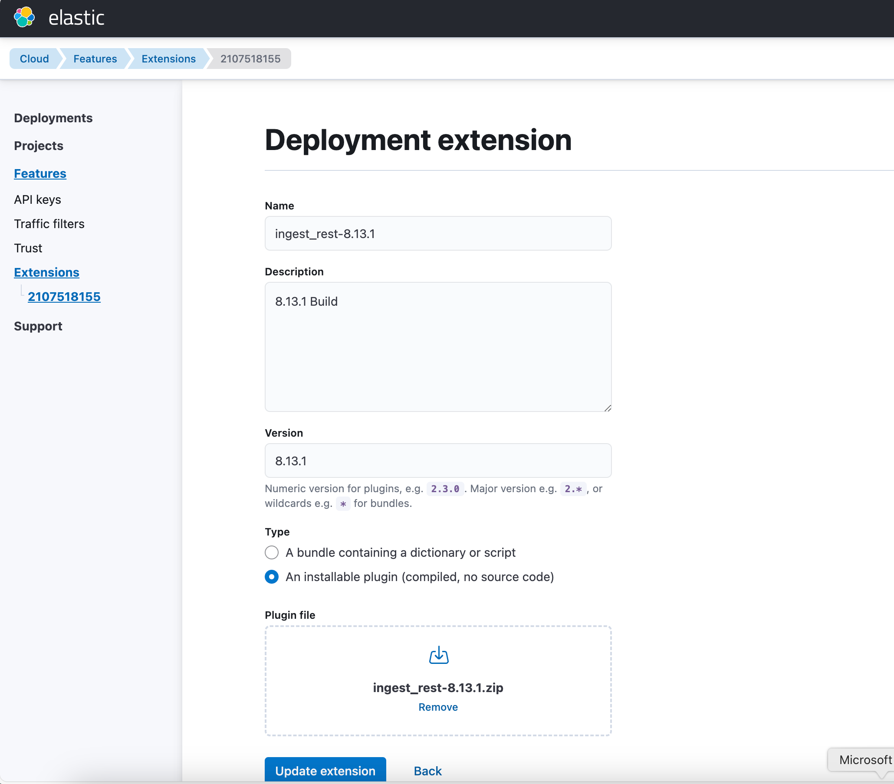
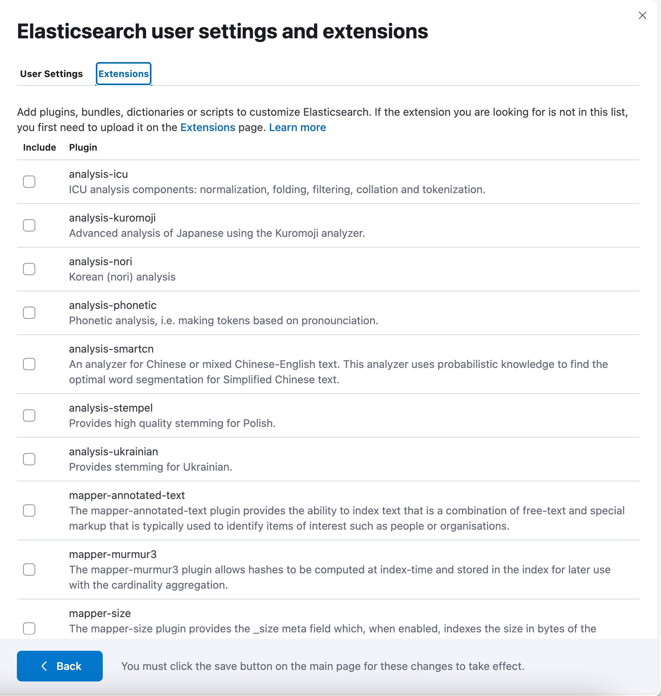

# Elasticsearch Ingest HTTP Plugin

This is an Elasticsearch Ingest Pipeline Processor that calls an HTTP(s) endpoint and adds the response back to the ingest document for further processing.

This was intially developed for work with Bookend.AI.

## Key Features
* Ability to call remote service via http(s) with data from ingest document
* Works on prem and in Elastic Cloud

## Installation

You have to install the plugin on all of the nodes using the elastcsearch-plugin command.

### Self Managed

```shell
$ bin/elasticsearch-plugin install file:///<path_to>/ingest_rest-8.13.1.zip
```

### Elastic Cloud

If you are an adminstrator of your elastic organization, you can deploy it via the following steps

Step 1 - Upload to your org


Step 2 - Goto your Cluster and Enable the Plugin


## Downloads

 We do have a few ready downloads which can be found at [releases](https://github.com/mcplusa/elastic-ingest-http/releases) for ready to install but we suggest building to the exact version yourself as plugins need to be built to the exact version that you are running. 

## Example Setup

```
PUT _ingest/pipeline/my-pipeline
{
  "description": "My optional pipeline description",
  "processors": [
    {
      "ingest_rest": {
        "field": "foo",
        "target_field": "bar",
        "endpoint":"https://control-plane-gateway-44gp1iu3.uc.gateway.dev/mcplusa/models/predict",
        "model_id": "7e009044-17cd-4132-b43f-cfd5cc5c61fd",
        "task": "named_entity_recognition",
        "content_type":"application/json",
        "method": "POST",
        "read_timeout": 100000,
        "connect_timeout": 100000

      }
    }
  ]
}
```

## Settings

| Name         | Required | default | Description                                                                                            |
|--------------|----------|---------|--------------------------------------------------------------------------------------------------------|
| field        | Yes      |         | The Source Field To Send.  This can be modified in a previous process to whatever shape the data needs |
| target_field | Yes      |         | The field the response should be inserted into                                                         |
|endpoint|Yes||The endpoint to call|
|content_type|Yes||the mimetype to transmit, typically this should be applicaiton/json|
|read_timeout|Yes||The http timeout on the response|
|connect_timeout|Yes||The connection timeout|

## Support

If you are interested in commerical support a different license, contact [MC+A](https://mcplusa.com/).

## License

his project is licensed under the GNU AFFERO GENERAL PUBLIC LICENSE. See the [License](./LICENSE) file for more details.This is 
